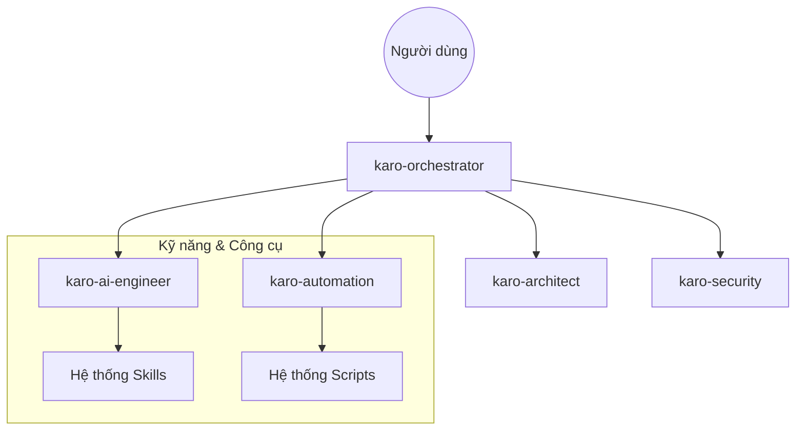

# KIẾN TRÚC HỆ THỐNG KARO AGENTS

Hệ thống Karo Agents được thiết kế theo mô hình **Hierarchical Agent Framework** (Khung tác vụ phân cấp), lấy cảm hứng từ Antigravity Kit.

## Sơ đồ Tổng quan
Hệ thống bao gồm một **Orchestrator** điều phối và các **Sub-agents** chuyên biệt.

## Các thành phần chính

### 1. Orchestrator (Người điều phối)
- **Tệp tin:** `agents/karo-orchestrator.md`
- **Vai trò:** Tiếp nhận yêu cầu của người dùng, phân tích ý định và phân phối nhiệm vụ cho các agent chuyên môn.

### 2. Agents (Tác tử chuyên môn)
Mỗi agent có một bộ quy tắc (Rules) và kỹ năng (Skills) riêng để giải quyết các vấn đề cụ thể:
- **karo-ai-engineer:** Chuyên gia kỹ thuật và lập trình.
- **karo-automation:** Chuyên gia tự động hóa quy trình.
- **karo-security:** Chuyên gia bảo mật và audit.
- **karo-documenter:** Chuyên gia viết tài liệu và phân tích.

### 3. Quy chuẩn (Rules)
Nằm trong thư mục `rules/`, định nghĩa các tiêu chuẩn vàng về:
- Lập trình (Coding Standards)
- Thiết kế (Design Principles - Premium Aesthetics)
- Bảo mật (Security Best Practices)

### 4. Kỹ năng (Skills)
Nằm trong thư mục `skills/`, đây là những "khối xây dựng" giúp các Agent thực hiện các tác vụ cụ thể như:
- Phân tích code
- Thiết kế Database
- Tối ưu hóa hiệu năng

## Quy trình làm việc (Workflows)
Các kịch bản tự động hóa nằm trong `workflows/`, cho phép thực hiện các quy trình phức tạp (như "Phát triển tính năng mới" hoặc "Fix bug") một cách nhất quán và có kiểm soát.
